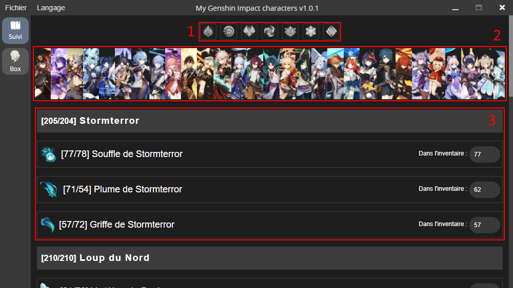
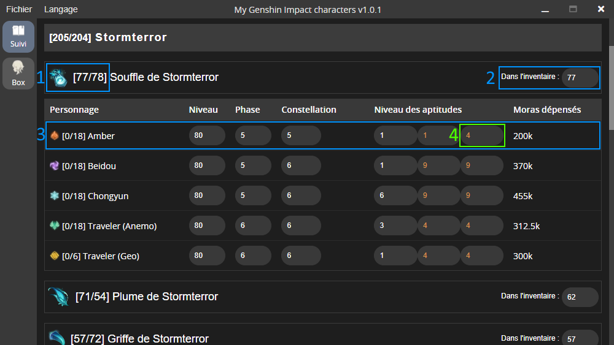

# My Genshin Impact Characters - How to use ?

## Software parts

1. **Character element filter** 
Click on an element to apply filter, the software will only display your owned characters that matches selected element(s)

2. **Top Characters** 
This part display your best character investment from left to right, better investments starts on the left. All character picture can be hovered with mouse to see the character name and his investment in mora. You can click on the character picture and the software will automatically scroll into the boss material part for this character. You can scroll this section by hovering the section and using your mousewheel.

3. **Boss Materials** 
Each weekly bosses drops 3 different types of materials, each materials are used to upgrade character aptitude levels. This part order your characters in a table for each material type and for each bosses. Each material line display an owned material counter and a max material counter, also the 3 material lines are added to form the total material counter, displayed aside the weekly boss name.

## Material table

1. **Material counter** 
Display material amount you own or you invested into character aptitudes and the maximum needed material amount to upgrade every owned characters aptitudes to level 10 (this should never happen but it's calculated). As you can see `Dvalin's Sigh` material contains 5 characters, 4 are using `Dvalin's Sigh` for all 3 aptitudes and `Traveler (Geo)` use `Dvalin's Sigh` only for normal attack aptitude. One aptitude need 6 materials to be fully upgraded (level 10 or 13 if you have constallation bonus, see 4.)

2. **In inventory materials** 
This field is used to tell the software how much material you have in your inventory, this field is automatically decreased when you upgrade an aptitude level, exemple for Amber's 3rd aptitude, passing it from level 6 to 7 will decrease the In Inventory field by 1 and will increase Amber's material counter to [1/18].

3. **Character data** 
This is here you set your character level, phase, constellation and aptitude levels. Phase is the number of ascensions you pass for the character (represented as stars in-game) this field is automatically increase when you set the character level, exemple : set level to 80 will set phase to 5 and set level to 81 will set pahase to 6, automatically.

4. **Aptitude field** 
This is where you set the aptitude level, left field is for normal attack, middle field is for elemental skill and right field for elemental burst. An orange value indicate you have the +3 bonus from a constellation. Tartaglia's normal attack always have a +1 bonus, so it's displayed in orange too.

## Resin optimisation purpose of this software

This software is made to help you optimize your resin before doing weekly bosses, it indicate what bosses materials you need for your characters aptitudes and what bosses you don't need to do anymore. As you can see in the screenshot, i've finished `Dvalin` and `Andrius` since i reach the max material amount for them (204 for Dvalin and 210 for Andrius) and i can use `Dream Solvent` to convert a certain material type to another. Thereby i can use my resin into other bosses or elsewhere.
