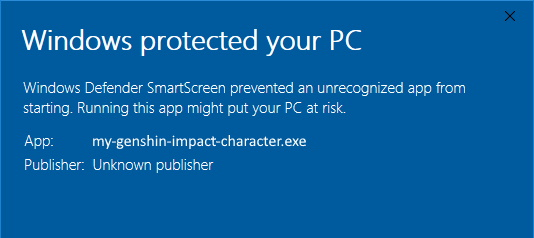

# My Genshin Impact characters

Helps Genshin Impact players to follow up invested ressources in their characters

--

## Installation

Download and install [the latest release](https://github.com/MatthieuLepers/my-genshin-impact-characters/releases/latest).

This software will automatically update itself after first installation.

### ➡️ About Windows SmartScreen "Windows protected your pc"

During installation, Windows SmartScreen can block the installation by warning the user about risks of uncknown apps, this warning is due to my app code signing. It's a free app and i'll not buy a Microsoft Code Signing Certificate to make this warning disapear, it cost 200~350$ per year.

See application reputation & windows smart screen [here](https://www.digicert.com/dc/ms-smartscreen-application-reputation/)

---

## Contributing
**⚠️ You should definitely read this part before making a contribution**

### Installation
Just clone the repository, run `npm install` to install all node dependencies, then run `npm run dev` to start the application.

### Pull requests
Please apply the naming convention when you create a branch:
- Create your branch from `develop`
- For new feature, name your branch as `feature/{your-feature-name}`
- For bug fix, name your branch as `fix/issue-{issue-number}` or `fix/{whatever-you-fixed}`
- I'm using [gitmoji](https://gitmoji.dev/) for all my commits, so please make sure to use it when you commit anything

Use `develop` branch as target branch for your pull requests. To contribute properly, try to have as few commits as possible, you can use `git rebase` to help you group your commits.

**⚠️ Any pull request that not respects contribution rules will be closed**

### Bug report
To report any bug, make an issue using the "Bug issue template" and follow the template instructions.

### Features
To make a feature or a request, make an issue using the "Feature issue template" and follow the template instructions.

---

## Disclaimer
This project is not affiliated with the game and/or its publishers. All rights reserved.

Thanks to [genshin.honeyhunterworld.com](https://genshin.honeyhunterworld.com/) for images

This project was generated with [electron-vue](https://github.com/SimulatedGREG/electron-vue)@[45a3e22](https://github.com/SimulatedGREG/electron-vue/tree/45a3e224e7bb8fc71909021ccfdcfec0f461f634) using [vue-cli](https://github.com/vuejs/vue-cli). Documentation about the original structure can be found [here](https://simulatedgreg.gitbooks.io/electron-vue/content/index.html).
